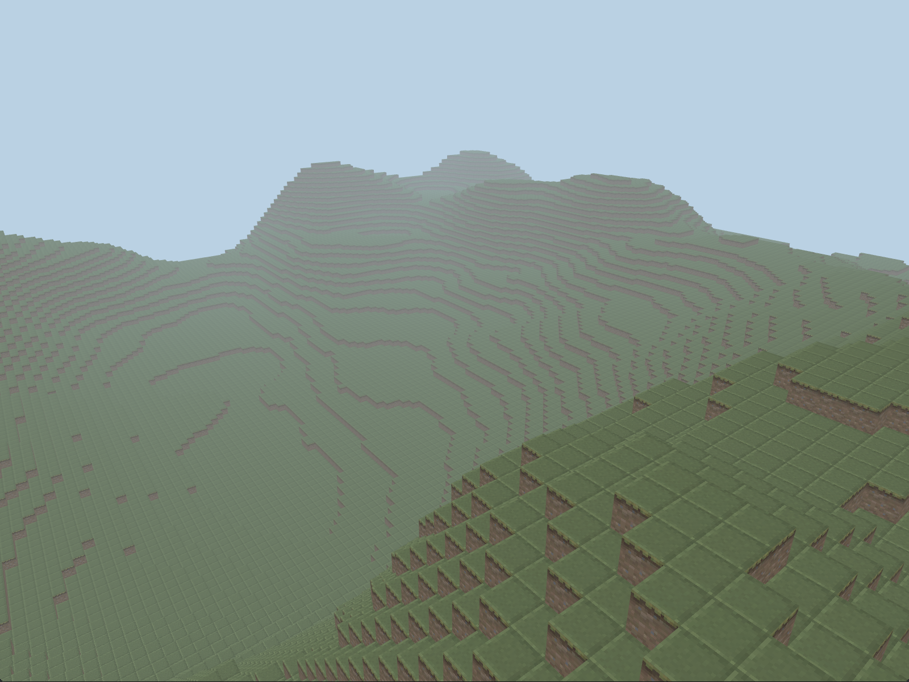

### Vokuselu

A basic voxels engine. This is a work in progress and not very
efficient yet.

Currently done:

* event manager
* removal of unseen voxels
* frustum culling
* Multitexturing
* Procedural generation of world

todo:
* implements meshing to reduce the number of vertices and enhance performance.
* physics (gravity/collision)

